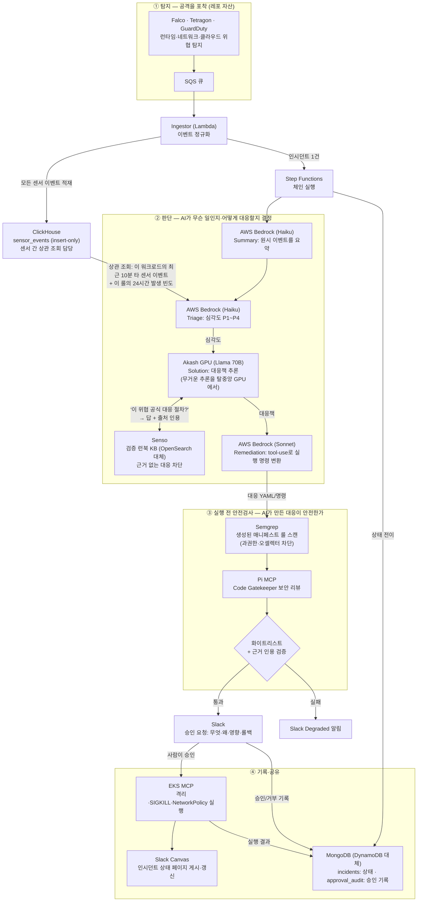

# SentinelEKS — 구현 기획서 (Build Spec)

Oct 9, 2026 · @Juan Lee

## 이 문서 사용법

이건 Claude Code / OpenCode에 그대로 먹여 작업을 시작하는 구현 기획서입니다. 추측이 아니라, 각 스폰서 API를 실제로 조사·검증해 '이 서비스가 진짜 지원하는 기능'만 설계에 넣었습니다(검증 결과는 다음 섹션). ElevenLabs는 억지 끼워넣기라 제거했고, 알림·승인은 Slack으로 통일했습니다.

스코프는 '해커톤 데모'입니다. 기존 [ATDR 레포](https://github.com/ninejuan/eks-ai-threat-detection-and-response)의 인프라(EKS·Falco·Tetragon·GuardDuty·Step Functions·MCP·Slack 봇)는 그대로 두고, AI 체인 부분만 스폰서 도구로 교체·강화합니다. 엔터프라이즈 설계 전체는 '엔터프라이즈 설계' 탭에 있고, 이 문서는 그중 '오늘 구현할 수직 슬라이스'만 다룹니다.

빌드 원칙 네 가지입니다. (1)레포의 동작하는 부분은 건드리지 않는다 — AI 체인(app/agents/)만 교체. (2)각 스폰서는 공식 API·MCP·CLI로 붙여 교체 비용을 최소화한다. (3)접근이 막히는 스폰서는 명시된 폴백으로 흐름을 살린다. (4)데모 한 경로가 끝까지 도는 것을 먼저 완성하고, 그다음 깊이를 더한다.

레포 출발점: `app/agents/{summary,triage,solution,remediation}/`가 현재 Bedrock을 호출합니다. 교체 대상은 이 네 디렉터리와 `app/shared/`의 모델 호출 모듈입니다. 그리고 DynamoDB 모듈은 MongoDB로 바꿉니다. 인프라(terraform/, kubernetes/)는 손대지 않고, terraform의 DynamoDB 리소스는 지우지 않은 채 안 씁니다.

## 스폰서 API 검증 결과

각 스폰서 공식 문서를 직접 확인해, 실제 지원 기능과 제약을 정리했습니다. 이 검증으로 설계가 몇 군데 바뀌었습니다(특히 Pi·induction labs).

| 스폰서 | 실제 지원(검증됨) | 제약·주의 | 이 설계에서의 역할 |
| --- | --- | --- | --- |
| AWS Bedrock | Claude(Haiku·Sonnet) invoke\_model, tool-use, 레포가 이미 사용 중 | AWS 크레딧으로 비용 커버 | Summary·Triage·Remediation 추론 |
| Akash (AkashML) | OpenAI 호환 API `api.akashml.com/v1`, Llama 3.3-70B·DeepSeek V3·Qwen3, $100 크레딧 | 오픈모델만 | Solution 대형 추론 (base\_url 한 줄 교체) |
| Senso | `POST /org/search`(근거답변+인용), `/search/context`(raw chunks), ingest API, MCP 서버, 인용 ledger 검증 | KB에 먼저 ingest 필요 | 대응 근거를 검증 런북에서 인용 |
| Semgrep | CLI `semgrep scan --config`, `p/kubernetes` 룰셋, 커스텀 룰 YAML, JSON/SARIF 출력, `--test` | 로컬 CLI면 계정 불필요 | 대응 매니페스트(YAML) 스캔 |
| Pi | MCP 서버 `mcp.pi.security/mcp`(도구 21개): findings·threat model·Code Gatekeeper 리뷰 조회, 리포트 제출 | **테넌트 레코드만 읽음. 임의 코드/행동 점검 아님** | 대응 코드의 Code Gatekeeper 리뷰 (역할 재배치) |
| ClickHouse | ClickHouse Cloud 무료 체험, 실시간 집계 SQL, HTTP/네이티브 클라이언트 | — | 센서 이벤트 적재 + Triage 상관 조회(승격 근거) |
| MongoDB | Atlas 무료 티어, 문서 저장, 벡터 검색 | — | DynamoDB 대체 — 인시던트 상태·승인 기록의 유일한 저장소 (Lambda→Atlas 연결과 Layer 필요) |
| Guild.ai | SDK·CLI로 에이전트 빌드, 컨트롤 플레인이 크리덴셜 주입·egress 정책·세션 중단·감사 로그, GitHub/Jira/Slack OAuth | **에이전트가 Guild 런타임에서 실행돼야 정책·크리덴셜·감사가 작동. 우리 Lambda+Step Functions 체인과 실행 모델이 충돌** | 데모에선 제외 (판단 근거는 아래 섹션). 쓰려면 알림 트리거 에이전트로 분리 |
| Slack Canvas | canvases.create/edit API로 상태 페이지(incident.io 스타일) 생성·갱신 | **canvases:write 스코프 필요, 유료 워크스페이스에서 standalone canvas 가능** | 인시던트 상태 페이지 게시·갱신 (induction labs 대체) |
| aws | 레포 인프라 전체(EKS·Lambda·Step Functions·KMS·S3) | — | 토대 (유지) |
| Slack | 봇·승인(레포에 이미 구현) | — | 알림·휴먼 승인 (ElevenLabs 대체) |

검증으로 바뀐 두 가지가 중요합니다. 첫째, Pi는 '행동 전 blast radius 점검'을 못 합니다 — 테넌트에 저장된 findings·Gatekeeper 리뷰를 읽는 MCP일 뿐입니다. 그래서 Pi는 'Remediation이 생성한 대응 코드/매니페스트를 Code Gatekeeper로 리뷰'하는 자리로 옮겼습니다. 둘째, induction labs는 공개 API가 확인되지 않아 뺐습니다. 대신 인시던트 상태 페이지는 Slack Canvas(`canvases.create`/`canvases.edit`)로 만듭니다 — incident.io 스타일의 '현재 인시던트' 페이지를 코드로 생성·갱신하고 채널에 공유할 수 있어, 별도 호스팅도 induction도 필요 없습니다. 이미 Slack 봇이 레포에 있어 가장 자연스럽습니다.

최소 3개 기준은 넉넉히 넘깁니다. 확실히 되는 핵심 축은 Bedrock·Akash·Senso·Semgrep·ClickHouse·MongoDB 6곳이고, Pi·Guild·AWS·Slack(Canvas 포함)까지 더해집니다.

### Guild.ai 조사 결과와 판단

Guild를 제대로 조사했습니다. 공식 문서 기준 핵심은 이렇습니다. Guild는 '에이전트를 Guild 런타임(별도 실행 서비스)에서 돌리고, 그 에이전트의 모든 외부·LLM 호출을 Guild 프록시로 통과시켜' 크리덴셜 주입·egress 정책·토큰 제한·감사를 거는 컨트롤 플레인입니다. 에이전트는 Agent SDK(`@guildai/agents-sdk`)로 TypeScript로 작성해 `guild agent init/test/save --publish`로 올리고, 웹훅·시간 트리거(Slack 멘션, GitHub PR 등)로 실행합니다.

여기서 근본적 불일치가 나옵니다. Guild의 거버넌스·감사·정책은 '에이전트가 Guild 런타임 안에서 실행될 때만' 작동합니다. 그런데 우리 AI 체인은 레포의 Lambda + Step Functions에서 돌아갑니다. Guild의 값을 제대로 쓰려면 체인을 TypeScript로 다시 써서 Guild 런타임에 올려야 하는데, 이건 '레포의 동작하는 부분은 안 건드린다'는 원칙과 하루라는 시간에 정면으로 어긋납니다. Lambda 밖에서 도는 코드는 Guild가 통제·감사하지 못하므로, 억지로 끼우면 '정책·감사 로그가 비어 있는 껍데기'가 되어 오히려 Guild 심사위원에게 간파당합니다.

판단: 데모 핵심 경로에서는 Guild를 뺍니다. 억지 끼워넣기(ElevenLabs와 같은 실수)를 반복하지 않습니다. 대신 Guild를 쓸 거면 '제대로 쓰는' 한 가지 방법만 둡니다 — 전체 체인이 아니라, '인시던트 알림·분류' 같은 가벼운 보조 에이전트 하나를 Agent SDK로 만들어 Guild 런타임에 올리고 Slack 웹훅 트리거로 연결하는 것입니다. 이건 Guild의 트리거·감사·정책이 실제로 작동하는 독립 조각이라 시그니처 사용이 됩니다. 단 이것도 당일 SDK 셋업·배포 시간이 필요하니, 시간이 남을 때만 붙이는 '선택 확장'으로 둡니다.

결론적으로 확실한 핵심 축은 Bedrock·Akash·Senso·Semgrep·ClickHouse·MongoDB 6곳 + Slack·AWS이고, Pi(MCP 리뷰)와 Guild(보조 에이전트)는 접근·시간이 되면 더하는 '제대로 쓰는 확장'입니다. 최소 3개를 훨씬 넘기므로 Guild를 빼도 Tool Use 기준엔 전혀 지장 없습니다.

## 확정 아키텍처

검증을 반영한 데모 구현 아키텍처입니다. 실선은 확실히 되는 경로, 점선 주석은 폴백입니다.



다이어그램 범례 — 각 스폰서가 '한 일':

- AWS Bedrock: 가벼운 추론 세 단계(Summary·Triage는 Haiku, Remediation은 Sonnet). 레포가 쓰던 방식 그대로. 체인의 두뇌.
- Akash: 무거운 추론 한 단계(Solution, Llama 70B)를 탈중앙 GPU에서 실행. OpenAI 호환 API라 클라이언트만 다르게.
- Senso: '이 위협의 공식 대응 절차가 뭔가'를 검증 런북에서 출처 인용과 함께 가져옴. 레포의 OpenSearch RAG를 대체. 근거 없으면 대응 자체를 막음.
- Semgrep: AI가 만든 대응 매니페스트(YAML)를 적용 전 룰 스캔 — 과도한 권한·잘못된 셀렉터 차단.
- Pi: 그 대응 코드를 Code Gatekeeper(MCP)로 한 번 더 보안 리뷰. Semgrep=룰 스캔, Pi=게이트키퍼 리뷰로 층이 다름.
- ClickHouse: Falco·Tetragon·GuardDuty 이벤트를 전부 적재해 두고, Triage 직전에 '같은 워크로드에서 최근 10분간 다른 센서가 뭘 봤나'를 조회. 센서 2개 이상이 겹치면 승격 — P3 세 건이 P1이 되는 근거가 여기서 나옴. 감사 저장소는 아님.
- MongoDB: 인시던트 상태(incidents)와 승인 기록(approval\_audit)의 유일한 저장소. 레포의 DynamoDB를 대체.
- Slack: 승인 요청(사람 개입) + Canvas로 인시던트 상태 페이지 게시.
- AWS: EKS·Lambda·Step Functions·SQS·EKS MCP 등 토대 전부.

한 문장 요약: 공격을 탐지(①)하면, AI가 요약·분류하고 검증된 근거로 대응책을 추론(②)한 뒤, 그 대응이 안전한지 코드 검사·보안 리뷰(③)를 거쳐, 사람이 Slack에서 승인하면 실행하고 기록·공유(④)합니다.

레포 대비 교체 지점은 CHAIN 서브그래프와 그 직후 검사 단계(SCAN·PI)뿐입니다. 탐지·큐·Step Functions·EKS MCP 대응·Slack 봇은 레포 그대로입니다. 그래서 '인프라 재배포 없이 AI 체인만 갈아끼우는' 작업이 됩니다.

## 데이터 계약

각 단계가 주고받는 데이터 형태를 고정합니다. Claude Code가 이 스키마대로 타입을 생성하면 됩니다.

저장소별 역할을 먼저 못 박습니다. 감사 저장소는 ClickHouse가 아니라 MongoDB입니다.

| 저장소 | 담는 것 | 쓰기 / 읽기 | 성격 |
| --- | --- | --- | --- |
| ClickHouse | 센서 원시 이벤트(Falco·Tetragon·GuardDuty) | Ingestor 쓰기 / Triage 조회 | insert-only, 센서 간 상관 조회 |
| MongoDB | 인시던트 상태, 승인 기록 | 체인·Slack 봇 쓰기·읽기 / Canvas 렌더링 | 상태의 단일 원천, `approval_audit`는 insert-only |
| S3 (Object Lock) | 포렌식 스냅샷 | EKS MCP 쓰기 | WORM, 레포 그대로. 변조 방지가 필요한 증거는 여기 |
| Prometheus·Grafana·Loki | 인프라 메트릭·컨테이너 로그 | — | 레포 그대로. 대시보드는 여기서 |
| DynamoDB | — | — | 사용 중지. terraform 리소스는 지우지 않고 그냥 안 쓴다 |

MongoDB 자체는 변조 방지(WORM)가 아니라서, `approval_audit`의 불변성은 앱 레벨 규칙(insert만 하고 수정·삭제 코드를 만들지 않음)입니다.

정규화 이벤트 스키마 (탐지 → 체인 입력):

```json
{
  "incident_id": "uuid",
  "tenant_id": "string",
  "cluster": "string",
  "namespace": "string",
  "workload": "string",
  "source": "falco | tetragon | guardduty",
  "rule_id": "string",
  "mitre_technique": "T1611",
  "process": {"pid": 0, "exe": "string", "cmdline": "string"},
  "network": {"direction": "egress", "remote": "ip:port"},
  "raw_hash": "sha256",
  "ts": "iso8601"
}
```

ClickHouse 테이블 — 센서 원시 이벤트 전용이고 insert-only입니다(UPDATE·DELETE 없음). 심각도 같은 체인 결과는 여기 넣지 않고 MongoDB `incidents`에 둡니다.

```sql
CREATE TABLE sensor_events (
  event_id        UUID,
  tenant_id       LowCardinality(String),
  cluster         LowCardinality(String),
  namespace       String,
  workload        String,
  source          LowCardinality(String),   -- falco | tetragon | guardduty
  rule_id         String,
  mitre_technique LowCardinality(String),
  ts              DateTime64(3)
) ENGINE = MergeTree
ORDER BY (tenant_id, namespace, workload, ts);   -- 아래 Q1 필터와 같은 순서

-- Q1. Triage 직전: 이 워크로드에서 최근 10분간 센서별로 무엇이 발생했나
SELECT source, rule_id, mitre_technique, count() AS n, max(ts) AS last_ts
FROM sensor_events
WHERE tenant_id = {tenant:String} AND namespace = {ns:String} AND workload = {wl:String}
  AND ts > now64(3) - INTERVAL 10 MINUTE
GROUP BY source, rule_id, mitre_technique
ORDER BY last_ts DESC;

-- Q2. 이 룰은 평소 얼마나 자주, 몇 개 워크로드에서 터지나 (노이즈 판별)
SELECT count() AS n_24h, uniqExact(workload) AS workloads
FROM sensor_events
WHERE tenant_id = {tenant:String} AND rule_id = {rule:String}
  AND ts > now64(3) - INTERVAL 24 HOUR;
```

Triage 에이전트는 Q1·Q2 결과를 프롬프트에 넣습니다. 승격은 LLM이 아니라 코드가 먼저 계산합니다: Q1에서 서로 다른 `source`가 2개 이상이면 최소 P2, 3개면 P1(임계값은 기본값이고 데모에서 조정). Q2에서 `n_24h`가 크고 `workloads`가 많으면 노이즈 후보로 표시해 승격 근거에서 감점합니다. LLM은 이 숫자를 근거로 rationale을 씁니다. 조회가 실패하면 `correlation: unavailable`로 기록하고, Slack Degraded 알림에 '상관 조회 실패'를 적어서 승격이 조용히 빠지는 일이 없게 합니다.

`clickhouse-connect`의 `client.query(sql, parameters={...})`가 `{name:Type}` 서버 측 바인딩을 지원하니 문자열 포매팅으로 쿼리를 만들지 않습니다.

MongoDB 컬렉션 — 레포 DynamoDB의 `incidents`·`approval-audit` 두 테이블을 1:1로 대체합니다. 인시던트 상태와 승인 기록의 유일한 저장소입니다.

```json
// collection: incidents  (_id = incident_id)
{
  "_id": "incident_id",
  "tenant_id": "string",
  "status": "detected|triaged|awaiting_approval|approved|remediated|rolled_back|denied",
  "severity": "P1",
  "summary": "string",
  "correlation": {"distinct_sources": 2, "sources": ["falco","tetragon"], "window_min": 10,
                  "rule_24h": {"n": 3, "workloads": 1}},
  "solution": {"action": "string", "citations": [{"content_id":"","title":""}]},
  "gate": {"semgrep": {"passed": true, "findings": 0}, "pi": {"passed": true, "notes": ""}},
  "actions_taken": ["isolate", "networkpolicy"],
  "canvas_id": "string",
  "audit": [{"stage": "", "at": "iso8601", "detail": ""}]
}

// collection: approval_audit  (insert-only: 수정·삭제 코드를 만들지 않는다)
{
  "incident_id": "string",
  "decision": "approve|deny",
  "by": "slack_user_id",
  "at": "iso8601",
  "action_summary": "승인 카드에 보여준 무엇·영향·롤백 그대로",
  "slack_message_ts": "string"
}
// indexes: approval_audit {incident_id: 1} · incidents {tenant_id: 1, status: 1}
```

상태 전이는 조건부 업데이트로 합니다. Slack은 재전송·중복 클릭이 있어서, 승인 처리가 두 번 실행되면 안 됩니다. 기존 DynamoDB 코드가 `ConditionExpression` 같은 조건부 쓰기를 쓰고 있다면 같은 의미로 이식하세요.

```python
r = incidents.update_one({"_id": iid, "status": "awaiting_approval"},
                         {"$set": {"status": "approved"}})
if r.modified_count == 0:   # 이미 처리된 승인
    return
```

체인 단계 간 계약 (각 에이전트 입출력):

```
Summary:     이벤트[] → { summary, affected: {ns, workload} }
Triage:      summary → { severity: P1..P4, rationale }
Solution:    summary+severity → { action, params, citations[] }   // Senso 인용 필수
Remediation: action → { tool_calls: [{tool, args}] }              // 화이트리스트 내에서만
```

액션 화이트리스트 (Remediation이 생성 가능한 tool\_calls, 이 밖은 거부):

```
isolate_pod(namespace, pod)
apply_networkpolicy(namespace, policy="deny-all")
sigkill_label(namespace, pod)
scale_deployment(namespace, deploy, replicas=0)
forensic_snapshot(namespace, pod)   // 파괴 전 필수 선행
```

## 컴포넌트별 구현 명세

레포 구조를 유지하면서 교체·신규 파일만 명시합니다. Claude Code는 이 표대로 파일을 만들거나 고치면 됩니다.

| 경로 | 상태 | 책임 | 입력 → 출력 | 의존성 |
| --- | --- | --- | --- | --- |
| `app/shared/llm.py` | 교체 | 모델 라우터: 단계별로 Bedrock/Akash 선택, 폴백 | (model\_role, messages) → completion | boto3(Bedrock) + openai SDK(Akash) |
| `app/shared/senso.py` | 신규 | Senso 검색·인용 ledger | question → {answer, citations\[\]} | requests, SENSO\_API\_KEY |
| `app/agents/summary/` | 교체 | 이벤트 요약 | 이벤트\[\] → summary | shared/llm (Bedrock) |
| `app/agents/triage/` | 교체 | 심각도 분류 + 상관 반영 | summary → severity | shared/llm (Bedrock), sink/clickhouse (상관 조회) |
| `app/agents/solution/` | 교체 | 대응 추천 + Senso 근거 | summary+sev → {action, citations} | shared/llm (Akash), shared/senso |
| `app/agents/remediation/` | 교체 | tool\_calls 생성 (화이트리스트 내) | action → tool\_calls\[\] | shared/llm (Bedrock Sonnet tool-use) |
| `app/gate/semgrep_check.py` | 신규 | 대응 YAML을 Semgrep으로 스캔 | manifest.yaml → {passed, findings} | semgrep CLI subprocess |
| `app/gate/pi_review.py` | 신규 | Pi MCP로 Code Gatekeeper 리뷰 | 대응 코드 → {review} | Pi MCP (mcp.pi.security) |
| `app/gate/verify.py` | 신규 | 근거 인용·액션 화이트리스트 검증 | solution+tool\_calls → pass/fail | — |
| `app/sink/clickhouse.py` | 신규 | 센서 이벤트 적재(Ingestor) + 상관 조회(Triage) | event → insert / (ns, workload, rule) → correlation | clickhouse-connect |
| `app/shared/ 의 기존 DynamoDB 모듈 (파일명은 grep으로 확인)` | 교체 | DynamoDB 대체. 호출부(슬랙 봇·에이전트·Ingestor)는 두고 모듈 내부만 pymongo로 | 인시던트 upsert · 승인 insert (기존 함수 시그니처 유지) | pymongo |
| `app/publish/postmortem.py` | 신규 | 인시던트 상태 페이지 게시·갱신 | incident → url | Slack canvases.create/edit |
| `app/slack_bot/` | 유지·확장 | 승인 요청에 영향·롤백 정보 추가 | — | 레포 기존 |

모델 라우터(`shared/llm.py`)가 교체의 핵심입니다. 역할→모델 매핑만 바꾸면 전체 체인이 따라옵니다.

```python
# shared/llm.py — 역할 기반 모델 라우팅 (Bedrock + Akash)
# Summary·Triage·Remediation은 Bedrock(레포 기존 방식 유지), Solution만 Akash GPU
import boto3, json
from openai import OpenAI

bedrock = boto3.client("bedrock-runtime", region_name=AWS_REGION)
akash   = OpenAI(base_url="https://api.akashml.com/v1", api_key=AKASH_KEY)  # OpenAI 호환

ROUTES = {
  "summary":     ("bedrock", "anthropic.claude-3-5-haiku-20241022-v1:0"),
  "triage":      ("bedrock", "anthropic.claude-3-5-haiku-20241022-v1:0"),
  "solution":    ("akash",   "meta-llama/Llama-3.3-70B-Instruct"),
  "remediation": ("bedrock", "anthropic.claude-3-5-sonnet-20241022-v2:0"),
}

def complete(role, messages, **kw):
    provider, model = ROUTES[role]
    if provider == "akash":
        try:
            return akash.chat.completions.create(model=model, messages=messages, **kw).choices[0].message.content
        except Exception:
            provider, model = "bedrock", ROUTES["remediation"][1]  # Akash 막히면 Bedrock 폴백
    # Bedrock (Anthropic Messages API 포맷)
    body = {"anthropic_version":"bedrock-2023-05-31", "max_tokens":2048, "messages":messages}
    resp = bedrock.invoke_model(modelId=model, body=json.dumps(body))
    return json.loads(resp["body"].read())["content"][0]["text"]
```

Summary·Triage·Remediation은 레포가 이미 쓰던 Bedrock(Haiku·Sonnet) 그대로라 사실상 원복이고, Solution만 Akash GPU(Llama 70B)로 바꿉니다. Bedrock은 OpenAI 호환이 아니라 Anthropic Messages 포맷이니 provider 분기가 필요하지만, 레포 `app/shared/`에 이미 Bedrock 호출 코드가 있어 그걸 재사용하면 됩니다.

Summary·Triage·Remediation은 레포가 이미 쓰던 Bedrock 그대로라 교체랄 것도 없고, Solution만 Akash(OpenAI 호환)로 바꾸면 됩니다. 라우터의 역할→모델 매핑 한 곳만 건드리면 전체 체인이 따라오는 게 이 설계가 짧은 시간에 되는 이유입니다.

## 에이전트 체인 구현

각 단계의 프롬프트 설계 원칙과 검증 로직입니다.

Summary (Bedrock Haiku): 정규화 이벤트 배열을 받아 사건을 구조화 요약. 출력은 JSON 고정(구조화 출력). 추측 금지, 이벤트에 있는 사실만.

Triage (Bedrock Haiku): 요약 + 상관 신호로 P1\~P4 분류. 상관 신호는 ClickHouse 조회(데이터 계약의 Q1·Q2)에서 가져오고, 승격은 코드가 먼저 계산합니다(서로 다른 센서 2개 이상 → 최소 P2, 3개 → P1). 입력에는 요약과 조회 결과를 함께 넣고, rationale에 조회 숫자를 인용하게 합니다. 출력은 severity + rationale.

Solution (Akash 대형 + Senso): 핵심 단계. 프롬프트에 'Senso 검색 없이는 조치를 추천하지 말라'를 명시하고, `senso.search(question)`로 검증 런북·CVE 대응 절차를 가져와 그 인용과 함께 action을 생성. citations 필드 필수.

```python
# agents/solution — 근거 강제 패턴
ev = senso.search(f"{technique} {workload} 대응 절차")   # {answer, citations[]}
if not ev["citations"]:
    return degraded("검증된 대응 근거 없음 → 사람에게")
sol = complete("solution", [
  {"role":"system","content":"아래 검증된 근거에만 기반해 대응을 추천하라. 근거 밖 추측 금지."},
  {"role":"user","content": f"근거:\n{ev['answer']}\n\n사건:\n{summary}"}
])
return {"action": parse(sol), "citations": ev["citations"]}
```

Remediation (Bedrock Sonnet, tool-use): action을 받아 실제 tool\_calls를 생성. function 정의를 '액션 화이트리스트'로 고정해, 모델이 화이트리스트 밖 호출을 못 만들게 함. 파괴적 조치(pod 삭제·scale 0) 앞에는 `forensic_snapshot`을 강제 선행.

검증 게이트 (gate/verify.py): 체인 출력을 실행 전 3중 검사. (1)인용 검증 — solution.citations의 content\_id가 실제 Senso ledger에 있는지. (2)화이트리스트 검증 — 모든 tool\_call이 허용 목록 내인지. (3)보호 네임스페이스 검증 — 대상이 kube-system 등 보호 대상이 아닌지. 하나라도 실패하면 Degraded로 Slack에 올리고 자동 실행 중단.

모델 라우팅은 앞 섹션 `shared/llm.py`대로. 비용·속도가 지배적인 Summary·Triage는 소형, 품질이 중요한 Solution은 Akash 70B, 정확한 tool-use가 필요한 Remediation은 Bedrock Sonnet. 전부 실패 시 소형 모델 폴백 후 그래도 실패면 Degraded.

## 데모 시나리오 구현

레포에 이미 있는 5개 MITRE 공격 시뮬 중 크립토마이닝(T1496)을 씁니다. 3분 안에 전 경로가 돌아야 합니다.

| # | 단계 | 실행 | 보여줄 화면 |
| --- | --- | --- | --- |
| 1 | 공격 시뮬 | `docs/11-runbooks/`의 크립토마이닝 스크립트를 데모 네임스페이스에서 실행 | 터미널 |
| 2 | 탐지 | Falco가 비정상 프로세스, Tetragon이 아웃바운드 포착 → SQS | Grafana/로그 |
| 3 | 센서 적재·상관 조회 | Ingestor가 센서 이벤트를 ClickHouse에 적재하고, Triage 직전에 같은 워크로드의 타 센서 이벤트를 조회 | 조회 결과 (센서 N개 · 10분 창) |
| 4 | AI 체인 | Bedrock 요약·Triage(ClickHouse 상관으로 P1 승격) → Akash Solution + Senso 인용 → Remediation tool\_calls | 체인 로그 (인용 content\_id 표시) |
| 5 | 검사 게이트 | Semgrep이 deny-all NetworkPolicy YAML 스캔 → Pi Code Gatekeeper 리뷰 → verify 통과 | 게이트 출력 |
| 6 | 승인 | Slack에 '무엇·왜·영향·롤백' 카드 → 원클릭 승인 | Slack |
| 7 | 대응 | forensic\_snapshot → 격리 → deny-all → scale 0 | kubectl 상태 변화 |
| 8 | 게시 | 인시던트 상태 페이지를 Slack Canvas로 게시 | 게시된 페이지 |
| 9 | 기록 | MongoDB에 전체 타임라인·감사 저장 | 문서 |

데모 안전장치는 세 가지입니다. 파괴적 대응은 데모 전용 네임스페이스에서만. AWS 학교 크레딧($500/24h)이 있어 현장에서 클러스터를 새로 띄워도 되지만, `make infra-up`이 15\~20분 걸리니 아침에 미리 올려두고 데모 직전까지 유지하는 게 안전합니다(끝나면 `make all-down`). 라이브로 안 되는 단계는 녹화로 대체하되, 핵심 경로(탐지→체인→대응→게시)는 반드시 라이브.

3분 발표 배분: 문제 15초 → 공격 시뮬+탐지 30초 → AI 체인(Senso 인용 강조) 60초 → 게이트+승인+대응 45초 → 게시+스폰서 지도 20초 → 마무리 10초. 'Senso 인용으로 근거 있는 대응', '화이트리스트+게이트로 안전한 자율'을 말로 못 박을 것.

## 구현 순서 (마일스톤)

Claude Code에 순서대로 지시하면 됩니다. 각 단계는 '끝났다'를 판정할 완료 기준을 가집니다. 핵심 경로를 먼저 세우고 게이트를 나중에 붙입니다.

| 순서 | 작업 | 완료 기준 |
| --- | --- | --- |
| M1 | `shared/llm.py` 모델 라우터 (Bedrock 유지 + Solution만 Akash) | Bedrock·Akash 양쪽으로 completion 성공 |
| M2 | `shared/senso.py` + KB에 런북 ingest | `/org/search`가 인용 달린 답 반환 |
| M3 | Solution 에이전트를 Akash+Senso로 교체 | action에 citations\[\] 채워짐 |
| M4 | Summary·Triage·Remediation을 라우터로 교체 | 체인이 tool\_calls까지 생성 |
| M5 | `gate/verify.py` 인용·화이트리스트·보호NS 검증 | 위반 입력이 Degraded로 분기 |
| M6 | `sink/clickhouse.py` 적재 + 상관 조회 → Triage 입력 연결 | 같은 워크로드의 센서 2개 이벤트가 Triage에서 승격되고, 근거(조회 결과)가 incidents.correlation에 남음 |
| M7 | `DynamoDB → MongoDB 교체`: 호출 지점 grep → 모듈 내부를 pymongo로(함수 시그니처 유지) → Layer·시크릿·Atlas 접근 | Slack 승인이 approval\_audit에 기록되고, 같은 버튼을 두 번 눌러도 대응은 한 번만 실행됨 |
| M8 | Slack 승인 카드에 영향·롤백 정보 추가 | 승인/거부가 상태에 반영 |
| M9 | 대응 경로(격리·NetPol) 데모 NS에서 검증 | 공격→격리 라이브 1회 성공 |
| M10 | `gate/semgrep_check.py` YAML 스캔 | deny-all YAML 스캔 결과 출력 |
| M11 | `gate/pi_review.py` Pi MCP Code Gatekeeper | 리뷰 결과 수신 |
| M12 | `publish/postmortem.py` Slack Canvas 게시 | 인시던트 Canvas 생성 + 채널 공유 |
| M13 | 전 경로 리허설 + 3분 녹화 | 1\~9단계 끊김 없이 1회 |

우선순위 원칙: M1\~M4(체인)·M6(상관 승격)·M9(대응)이 데모의 척추입니다. 시간이 모자라면 M10·M11(Semgrep·Pi 게이트)과 M12(게시)는 녹화·슬라이드로 대체해도 핵심은 성립합니다. 단, M2·M3(Senso 근거)는 챌린지의 'truthful sources'라 반드시 라이브로.

접근 막힘 대응: Akash 막히면 M1 라우터에서 solution도 Bedrock Sonnet으로(폴백 이미 구현). Senso 막히면 레포의 OpenSearch RAG 유지하되 '인용'만 강조. Pi 막히면 M11 건너뛰고 Semgrep만. Slack Canvas는 유료 워크스페이스 기능이니, 무료 워크스페이스면 상태 페이지를 채널 메시지(스레드)로 대체. Atlas 연결이 안 되면 Network Access에 NAT Gateway EIP가 등록됐는지부터 확인.

## 환경변수·시크릿·사전준비

Claude Code가 바로 쓸 설정입니다. 값은 부스/대시보드에서 발급.

```bash
# 모델
AWS_REGION=us-west-2         # Bedrock 리전 (Claude 모델 활성화 필요)
# Bedrock은 IAM(Pod Identity/IRSA)로 인증 — 별도 키 없음, 레포 기존 방식
AKASH_API_KEY=...            # playground.akashml.com, $100 크레딧
AKASH_BASE=https://api.akashml.com/v1

# 근거 KB
SENSO_API_KEY=...            # docs.senso.ai, KB scope 필요
SENSO_BASE=https://apiv2.senso.ai/api/v1

# 데이터
CLICKHOUSE_URL=https://...   # ClickHouse Cloud 무료 체험
CLICKHOUSE_USER=default
CLICKHOUSE_PASSWORD=...
MONGODB_URI=mongodb+srv://...  # Atlas 무료 티어. Secrets Manager(atdr/mongodb/uri)에 저장, Lambda가 읽음

# 게이트
# Semgrep: pip install semgrep (계정 불필요, p/kubernetes 룰셋)
PI_MCP_URL=https://mcp.pi.security/mcp   # OAuth, 테넌트 필요

# 레포 기존 (유지)
SLACK_BOT_TOKEN=xoxb-...
SLACK_SIGNING_SECRET=...
MCP_AUTH_TOKEN=...           # openssl rand -hex 32
```

사전 준비 체크리스트:

- [ ] AWS Bedrock에서 Claude Haiku·Sonnet 모델 액세스 활성화(리전 확인) + invoke\_model 테스트
- [ ] AkashML 가입 → 키 발급, `/v1/chat/completions`로 Llama 3.3-70B 호출 테스트
- [ ] Senso 가입 → KB 생성 → 런북 몇 개 ingest → `/org/search` 인용 확인
- [ ] ClickHouse Cloud 인스턴스 + `sensor_events` 테이블 생성
- [ ] MongoDB Atlas 클러스터 + `incidents`·approval\_audit 컬렉션 + NAT Gateway EIP를 Network Access에 등록
- [ ] `grep -rni dynamodb app/ terraform/`로 사용처 확보 — Step Functions 정의에 DynamoDB를 직접 호출하는 상태가 있으면 Lambda 태스크로 바꿔야 해서 가장 먼저 확인
- [ ] Lambda Layer에 `pymongo`·`clickhouse-connect` 추가 (`make deploy-layer`, 빌드는 `pip install --platform manylinux2014_x86_64 --python-version 3.12 --only-binary=:all: -t python/ pymongo clickhouse-connect`)
- [ ] Mongo 클라이언트는 핸들러 밖(전역)에서 생성해 재사용 — Slack은 3초 안에 ack해야 해서 콜드 연결이 위험
- [ ] `pip install semgrep` + `semgrep --config p/kubernetes` 동작 확인
- [ ] Pi 부스에서 테넌트·MCP 접근 문의 (막히면 M11 생략)
- [ ] Slack 워크스페이스가 Canvas 지원(유료)인지 확인 + canvases:write 스코프 추가
- [ ] AWS 학교 크레딧($500/24h) 계정으로 아침에 `make infra-up` → `make status` 통과 (끝나면 `make all-down`)

KB ingest 내용: 레포 `docs/11-runbooks/`의 대응 절차와 MITRE 기법별 조치를 Senso에 넣으면, Solution 단계가 바로 그걸 인용합니다. 이게 'truthful sources'를 가장 자연스럽게 구현하는 방법입니다.

이 문서 전체를 Claude Code에 주고 '구현 순서 마일스톤 M1부터 시작해'라고 하면 바로 착수됩니다.
