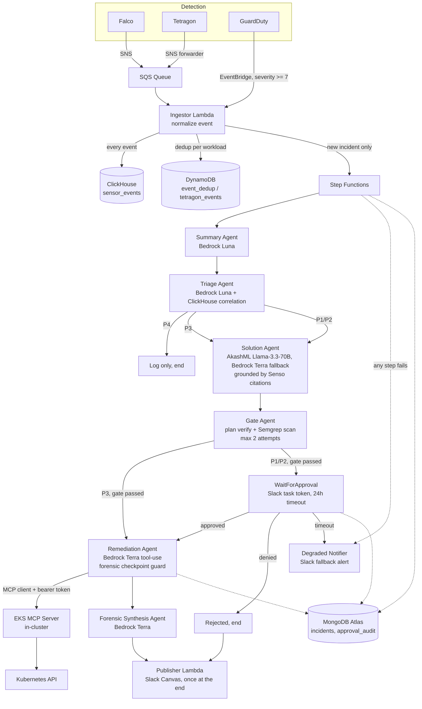

# SentinelEKS (SEKS)

AI-assisted runtime threat detection and human-approved remediation for Amazon EKS. Falco, Tetragon, and GuardDuty detect threats at the kernel, network, and cloud-control-plane layers. A chain of LLM agents summarizes, triages, and plans a response. A safety gate verifies the plan against a tool whitelist and a Semgrep scan. A human approves or denies in Slack. Approved remediation runs through an EKS MCP server, never through a direct Kubernetes client. A forensic postmortem gets published to a Slack Canvas when the run finishes. Built for CyberHack26.

## Architecture



Reference diagrams for the original architecture intent: `refs/eksai1.jpg`, `refs/eksai2.jpg`. These files are referenced in `AGENTS.md` as the source-of-truth diagrams but are not present in this checkout; the closest available artifact is `architecture.png` at the repo root.

Code paths behind each hop:

- Ingestor: `app/ingestor/handler.py`. Triggered by SQS (with SNS envelope unwrapping). Writes every event to ClickHouse before checking dedup, so correlation sees events that later get deduplicated. Dedup is a conditional `put_item` against DynamoDB table `seks-event-dedup`. Starts the Step Functions execution for new incidents only.
- State machine: `aws_sfn_state_machine.agent_pipeline` in `terraform/modules/lambda/main.tf`. Severity P4 ends at a `Pass` state (log only). P3 skips human approval if the gate passes. P1/P2 always wait for Slack approval through `lambda:invoke.waitForTaskToken` with `TimeoutSeconds = 86400` (24h). Every task state has a catch-all to the degraded notifier. A denied approval still reaches the publisher, so a postmortem gets written even for rejected incidents.
- Triage correlation: `app/sink/clickhouse.py` runs a 10-minute cross-sensor window query and a 24-hour rule-noise query against `sensor_events`. Three or more distinct sensors sets a P1 floor; two sets a P2 floor. The LLM can raise severity but never lower it below this floor.
- Solution grounding: `app/agents/solution/handler.py` calls `Senso.search_scoped()` restricted to a verified manifest of runbook content IDs. No citations means the agent degrades to a human handoff instead of guessing.
- Gate: `app/agents/gate/handler.py` plus the `app/gate/` package (`verify.py`, `semgrep_check.py`, `manifests.py`). Regenerates the plan once (`MAX_ATTEMPTS = 2`) with feedback from the failed attempt before giving up.
- Remediation: `app/agents/remediation/handler.py` plus `app/agents/remediation/tools.py`. Talks only to the EKS MCP server over HTTP with a bearer token.
- Forensic synthesis and publishing: `app/agents/forensic_synthesis/` and `app/publish/handler.py`. The Canvas gets built once, from the final MongoDB state, after remediation and forensic synthesis both finish (or fail).

## Safety guarantees

- Lambda remediation code never touches the Kubernetes API, a kubeconfig, or `kubectl`. It only calls the EKS MCP server through an HTTP client with a bearer token (`app/agents/remediation/tools.py::execute_tool`, `mcp_server/server.py`). A grep for `kubectl`, `kubernetes.client`, and `subprocess` in `app/agents/remediation/` returns nothing.
- Destructive or network-isolating tool calls (`delete_pod`, `apply_cilium_network_policy`, `cordon_node`, `drain_node`, and `patch_deployment` with `replicas=0`) are blocked until a successful `checkpoint_pod` entry exists in the current run's execution log. The guard runs before the MCP client is called, in both the LLM tool loop and the pre-approved plan executor (`app/agents/remediation/handler.py`).
- The gate rejects empty plans and any tool call outside an explicit whitelist. `cordon_node`, `drain_node`, and the experimental checkpoint tool are human-only and never auto-approved (`app/gate/verify.py`).
- System-owned values, forensics bucket name, cluster name, AWS region, and the incident ID, never appear in any MCP tool `input_schema` exposed to the LLM. The incident ID is injected server-side after the model picks a tool (`app/agents/remediation/tools.py`), and the MCP server re-sanitizes it against a strict pattern before it touches any path or label (`mcp_server/server.py::_sanitize_incident_id`). An unparseable ID falls back to the literal string `"adhoc"`.
- Every P1/P2 incident requires a human decision in Slack before remediation runs. The approval state transition is a conditional MongoDB update (`status` must still be `awaiting_approval`); a second click on the same button is a no-op because `modified_count` comes back `0` (`app/shared/store.py::IncidentStore.transition`). A unique index on `(incident_id, slack_message_ts, decision)` is a second layer of protection against duplicate Slack retries.
- `approval_audit` is insert-only at the application level: the `ApprovalAudit` class only exposes `record()` (insert) and `for_incident()` (read). No update or delete path exists for that collection.

## Models and sponsor tech

| Role | Provider | Model / Service | Fallback |
| --- | --- | --- | --- |
| Summary | AWS Bedrock | `us.openai.gpt-5.6-luna` | none |
| Triage | AWS Bedrock | `us.openai.gpt-5.6-luna` | none |
| Solution | AkashML | `meta-llama/Llama-3.3-70B-Instruct` | Bedrock `us.openai.gpt-5.6-terra` on `AkashError` |
| Remediation | AWS Bedrock | `us.openai.gpt-5.6-terra` | none |
| Forensic synthesis | AWS Bedrock | `us.openai.gpt-5.6-terra` | none |

Model routing lives in `app/shared/llm.py`; the role-to-model map and the Akash-to-Bedrock fallback are both in `terraform/envs/demo/main.tf` and `app/shared/config.py`. "Luna" is the fast model for summary and triage; "Terra" is the heavier model for solution fallback, remediation tool-use, and forensic synthesis.

Other sponsor integrations:

- **Senso**: knowledge base of response runbooks. `app/shared/senso.py` calls `search_scoped()` with `require_scoped_ids: True`, so the Solution agent can only cite content that was actually ingested, never free-floating model knowledge.
- **ClickHouse Cloud**: `sensor_events` table (`app/sink/clickhouse.py`), insert-only, 30-day TTL. Feeds the Triage correlation queries.
- **MongoDB Atlas**: `incidents` and `approval_audit` collections (`app/shared/store.py`), the single source of truth for incident state and the human approval trail. Replaces the DynamoDB tables that AGENTS.md and the original design called for; those DynamoDB resources (`aws_dynamodb_table.incidents`, `aws_dynamodb_table.approval_audit`) still exist in Terraform but are not written to by the current code. Two other DynamoDB tables, `event_dedup` and `tetragon_events`, are unrelated and are actively used by the ingestor and the MCP server.
- **Slack**: Block Kit approval cards with task-token callbacks, plus a Canvas (`canvases.create` / `canvases.edit`) for the incident postmortem page.

## Repository layout

```
app/
  agents/{summary,triage,solution,gate,remediation,forensic_synthesis}/  AI agent handlers
  ingestor/              SQS/SNS/EventBridge -> ClickHouse + Step Functions trigger
  approval_notifier/     Slack approval card + waitForTaskToken callback
  degraded_notifier/     Fallback Slack alert on any pipeline failure
  gate/                  Plan verification: whitelist, citations, Semgrep (app/gate/verify.py)
  publish/               Slack Canvas postmortem publisher (app/publish/handler.py)
  sink/                  ClickHouse sensor event sink and correlation queries
  shared/                Bedrock/Akash client, Mongo store, Senso client, Slack, config, secrets
  slack_bot/              Slack events, interactions, commands
mcp_server/              In-cluster EKS MCP server (Dockerfile, server.py, hubble_client.py, proto/)
terraform/
  modules/                Reusable modules (vpc, eks, lambda, iam, guardduty, s3, slack, ...)
  envs/demo/              Demo environment composition
kubernetes/
  falco/                  Falco Helm values + custom rules
  tetragon/               Tetragon TracingPolicies + SNS forwarder
  monitoring/             Prometheus, Grafana, Loki
  external-secrets/       ClusterSecretStore + ExternalSecrets
  admission-policies/     ValidatingAdmissionPolicy (CEL)
  mcp/                    EKS MCP server deployment manifest
  demo/                   Demo attack target namespace
rules/                    Semgrep custom rules for the gate
scripts/                  One-off operational scripts (secrets, demo attack, OpenSearch/KB setup)
slack/                    Slack app manifest template
tests/                    pytest unit tests mirroring app/ structure
docs/                     Design documents (Korean)
```

`AGENTS.md`'s own "Directory Structure" section predates several of these directories (`app/gate`, `app/publish`, `app/sink`, `mcp_server/` at the top level, `rules/`, `scripts/`, `slack/`); the layout above reflects what is actually on disk.

## Deploy

Prerequisites:

- AWS account with Bedrock model access enabled for the configured model IDs, Terraform >= 1.10, Docker, `kubectl`, `helm`, Python 3.12
- Sponsor accounts: AkashML (AKASHML_API_KEY), Senso (SENSO_API_KEY), ClickHouse Cloud (CLICKHOUSE_HOST/USERNAME/PASSWORD), MongoDB Atlas (MONGODB_URI)
- A Slack workspace with permission to install an app from a manifest and `canvases:write` scope for the postmortem Canvas

Region is `us-east-1` by default (`terraform/envs/demo/variable.tf`). Domain is `seks.juany.dev`.

Configure `terraform/envs/demo/terraform.tfvars` (copy from `terraform.tfvars.example`):

```hcl
environment  = "demo"
project_name = "seks"
region       = "us-east-1"

endpoint_public_access_cidrs = ["<your-ip>/32"]   # restrict from 0.0.0.0/0 for anything but a demo
slack_incident_channel       = "<your-slack-channel-id>"
```

All variables in `terraform/envs/demo/variable.tf` have defaults, so a bare `terraform.tfvars` with just the Slack channel ID is enough to start.

Sponsor credentials go in a local `.credentials` file (not committed) read by `make sponsor-secrets`:

```bash
AKASHML_API_KEY=<akash-api-key>
SENSO_API_KEY=<senso-api-key>
CLICKHOUSE_HOST=<your-instance>.clickhouse.cloud
CLICKHOUSE_USERNAME=default
CLICKHOUSE_PASSWORD=<clickhouse-password>
MONGODB_URI=mongodb+srv://<user>:<password>@<cluster>.mongodb.net/seks
```

MongoDB Atlas and ClickHouse Cloud both default to IP allowlisting. Once `make infra-up` creates the VPC and NAT gateway, add the NAT gateway's Elastic IP to Atlas Network Access and to the ClickHouse Cloud IP allowlist, or neither Lambda nor the agents can reach them.

All infrastructure mutation goes through Make targets, never raw `terraform apply` or `kubectl apply`:

| Target | What it does |
| --- | --- |
| `make infra-up` | Builds Lambda artifacts, creates the Terraform state bucket, applies the gate ECR repo, pushes a bootstrap gate image, applies the rest of the AWS infrastructure, writes kubeconfig, generates the Slack app manifest |
| `make secrets` | Prompts for and stores the Slack bot token, signing secret, and MCP auth token in Secrets Manager |
| `make sponsor-secrets` | Reads `.credentials` and stores AkashML/Senso/ClickHouse/MongoDB credentials in Secrets Manager |
| `make sponsor-setup` | Runs `scripts/setup_datastores.py` and `scripts/ingest_knowledge.py` against the sponsor services |
| `make platform-up` | Installs Cilium, the AWS Load Balancer Controller, Falco, Tetragon, External Secrets, kube-prometheus-stack, Loki, and the EKS MCP server onto the cluster |
| `make deploy-layer` | Builds and publishes the shared Python Lambda layer |
| `make deploy-lambdas` | Packages and pushes code for every agent Lambda, the ingestor, notifiers, and the publisher |
| `make all-up` | `infra-up` + `secrets` + `sponsor-secrets` + `sponsor-setup` + `platform-up` + `deploy-layer` + `deploy-lambdas` + `build-gate` |
| `make demo-up` | Applies the demo attack target namespace and waits for it to roll out |
| `make demo-attack` | Runs the cryptomining simulation against the demo namespace |
| `make platform-down` | Removes Helm releases, CRDs, and namespaces from the cluster |
| `make infra-down` | Destroys the Terraform-managed AWS infrastructure (with a forensics-bucket retention workaround baked in) |
| `make all-down` | `platform-down` then `infra-down` |
| `make status` | Prints node status, non-Running pods, and the Grafana ingress hostname |
| `make lint` / `make lint-fix` | ruff, yamllint, and `terraform fmt -check` across `app/`, `tests/`, `mcp_server/`, and `kubernetes/` |
| `make test` | `PYTHONPATH=. pytest tests/ -v --tb=short` |

A full `make infra-up` run takes roughly 15-20 minutes.

## Demo

```
make demo-up
make demo-attack
```

`make demo-attack` runs `scripts/simulate_cryptomining.sh`, which execs into the demo pod and writes a two-line shell script to `/tmp/xmrig`. That script sends a single JSON-RPC login message over `nc` to `stratum-sink.demo.svc.cluster.local:3333`, an in-cluster Kubernetes service, and exits. No miner binary runs, and the connection target is never outside the cluster. Falco flags the suspicious process name and the raw network connect; Tetragon flags the egress at the kernel level. Both land in ClickHouse and correlate into one incident, which the chain carries through to a single Slack approval card.

## Development

```bash
PYTHONPATH=. pytest tests/ -v --tb=short   # or: make test
ruff check app tests mcp_server            # or: make lint
ruff check --fix app tests mcp_server && ruff format app tests mcp_server   # or: make lint-fix
pre-commit install                          # one-time, runs the hooks below on every commit
```

Pre-commit hooks (`.pre-commit-config.yaml`): trailing-whitespace, end-of-file-fixer, check-yaml, check-json, check-merge-conflict, detect-private-key, `terraform fmt`, `terraform validate`, ruff (lint + format), yamllint.

## Known limitations

- The Slack Canvas postmortem is published once, after the pipeline finishes (or fails), not updated incrementally as each stage completes. A long-running incident will not show live progress in the Canvas.
- GuardDuty's cryptomining finding type requires contacting a real external mining pool to trigger, which the demo intentionally does not do. The demo path exercises Falco and Tetragon live; the GuardDuty EventBridge wiring exists in Terraform (`terraform/modules/guardduty/main.tf`) and is reachable from a real finding, but is not reproducible from the harmless demo script.
- `checkpoint_container_experimental` is best-effort. If runtime capability detection fails (missing kubelet CA, unreachable node, unsupported container runtime), it reports `status="unsupported"` with a `fallback_recommendation` pointing at `collect_live_pod_forensics` instead of throwing. This is an expected, non-fatal outcome, not a remediation failure.
